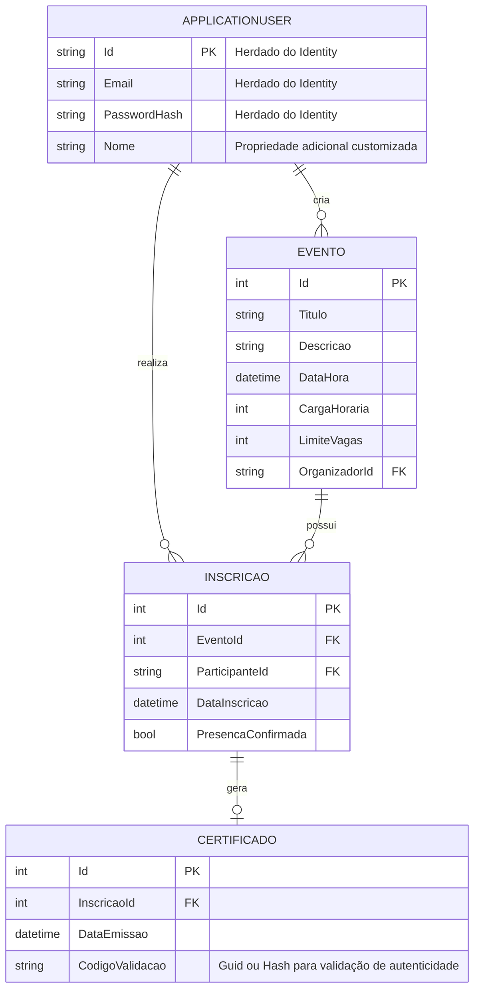

# Resultado 1: Análise, Modelagem e Estrutura do UniEvent

Este documento descreve o levantamento de requisitos e a modelagem inicial do sistema **UniEvent**.

## 1. Identificação dos Atores
- **Organizador**: Representa a coordenação e os professores. Responsável pela criação e gestão dos eventos acadêmicos, controle de vagas, e validação de presença (check-in).
- **Participante**: Representa os alunos. Pode visualizar a agenda de eventos, realizar inscrição e, posteriormente, emitir seu certificado de participação.

## 2. Requisitos Funcionais (RF)
- **RF01 - Gestão de Usuários**: O sistema deve permitir o cadastro de novos usuários (Organizadores ou Participantes).
- **RF02 - Autenticação**: O sistema deve permitir o login seguro dos usuários cadastrados.
- **RF03 - Gestão de Eventos**: Organizadores devem poder criar, editar, visualizar e excluir eventos. Um evento deve conter: título, descrição, data/hora, carga horária e limite de vagas.
- **RF04 - Portal de Eventos**: O sistema deve listar os eventos disponíveis para os Participantes visualizarem.
- **RF05 - Inscrição em Eventos**: O Participante deve conseguir se inscrever em um evento aberto, desde que haja vagas disponíveis.
- **RF06 - Check-in Digital**: O Organizador deve poder realizar a validação de presença dos participantes inscritos em seu evento.
- **RF07 - Geração de Certificados**: O sistema deve gerar um arquivo PDF real e disponível para download, utilizando automaticamente os dados do usuário e da inscrição (nome completo, nome do evento, data do evento, carga horária, data de emissão e código único de validação). O certificado só será emitido para participantes com presença confirmada.
- **RF08 - Histórico do Participante**: O Participante deve ter acesso a uma área com o histórico de eventos em que se inscreveu e seus respectivos certificados.
- **RF09 - Validação Pública de Certificados**: O sistema deve fornecer uma página pública (ex: `/Certificados/Validar`), que não exija autenticação, onde qualquer pessoa poderá verificar a autenticidade de um certificado informando seu código único. O sistema exibirá apenas os dados básicos para confirmação (nome, evento, data, carga horária, data de emissão e situação), protegendo dados sensíveis do usuário.

## 3. Requisitos Não Funcionais (RNF)
- **RNF01 - Stack Tecnológica**: A aplicação será desenvolvida em C#, ASP.NET Core MVC e Entity Framework Core.
- **RNF02 - Banco de Dados**: Será utilizado o SQL Server como banco de dados relacional.
- **RNF03 - Interface (Frontend)**: As views utilizarão HTML5, CSS3 e Bootstrap, visando responsividade e boa usabilidade em diferentes dispositivos.
- **RNF04 - Controle de Versão**: Todo o código-fonte e documentação serão mantidos no Git e hospedados no GitHub.
- **RNF05 - Segurança**: O sistema adotará integralmente o **ASP.NET Core Identity** para cuidar da autenticação de usuários, criptografia de senhas, validações e controle de autorização através de **Roles** (Papéis).

## 4. Regras de Negócio (RN)
- **RN01 - Limite de Vagas**: O sistema deve impedir que um Participante se inscreva em um evento caso a capacidade máxima (limite de vagas) já tenha sido atingida.
- **RN02 - Emissão Condicional de Certificados**: O certificado de participação **só pode ser gerado/emitido** caso o status de presença (check-in) do participante na respectiva inscrição conste como "Confirmado" (validado pelo Organizador).
- **RN03 - Controle de Acesso**: Apenas Organizadores (Role `Organizador`) podem criar eventos e validar presença. Participantes (Role `Participante`) são restritos à visualização, inscrição em eventos e geração de seus próprios certificados.
- **RN04 - Inscrição Única**: Um participante não pode se inscrever mais de uma vez no mesmo evento.

## 5. Casos de Uso (Diagrama Lógico)

```mermaid
usecaseDiagram
    actor Organizador
    actor Participante

    usecase "Cadastrar-se / Fazer Login" as UC1
    usecase "Criar e Gerenciar Eventos" as UC2
    usecase "Visualizar Portal de Eventos" as UC3
    usecase "Inscrever-se em Evento" as UC4
    usecase "Realizar Check-in (Validar Presença)" as UC5
    usecase "Emitir Certificado em PDF" as UC6

    Organizador --> UC1
    Participante --> UC1
    
    Organizador --> UC2
    Participante --> UC3
    Participante --> UC4
    Organizador --> UC5
    Participante --> UC6

    usecase "Consultar Histórico de Participação" as UC8
    Participante --> UC8

    actor "Público Externo (Terceiros)" as Publico
    usecase "Validar Autenticidade do Certificado" as UC7
    Publico --> UC7

    UC4 ..> UC3 : <<include>>
```

## 6. Modelagem de Dados Revisada (Entidades e Relacionamentos)
A estrutura utiliza o `ApplicationUser` (herdando do `IdentityUser` do ASP.NET Core Identity).



## 7. Definição Estrutural da Aplicação
- **Padrão MVC**: Separação clara em `Models`, `Views` e `Controllers`.
- **Camada de Acesso a Dados**: Pasta `Data` com o `ApplicationDbContext` (que herdará de `IdentityDbContext`).
- **Camada de Regras de Negócio e Serviços**: Pasta `Services` para isolar lógicas mais complexas (como validação de limite de vagas e geração de PDF).
- **Views**: Uso de Layouts e Partial Views.

## 8. Planejamento de Testes (Resultado 3)
A validação das regras relacionadas à geração de certificados incluirá obrigatoriamente os seguintes testes de fluxo:
- Tentativa de emissão de certificado sem presença confirmada (deve ser bloqueada).
- Emissão bem-sucedida com presença confirmada.
- Geração correta e persistência do código único na entidade `Certificado`.
- Geração real e download do documento em PDF.
- Validação bem-sucedida de um código existente na página pública.
- Consulta de validação utilizando um código inexistente (deve exibir mensagem apropriada).
- Garantia de segurança de que um participante não consiga emitir certificado pertencente a outro usuário.
